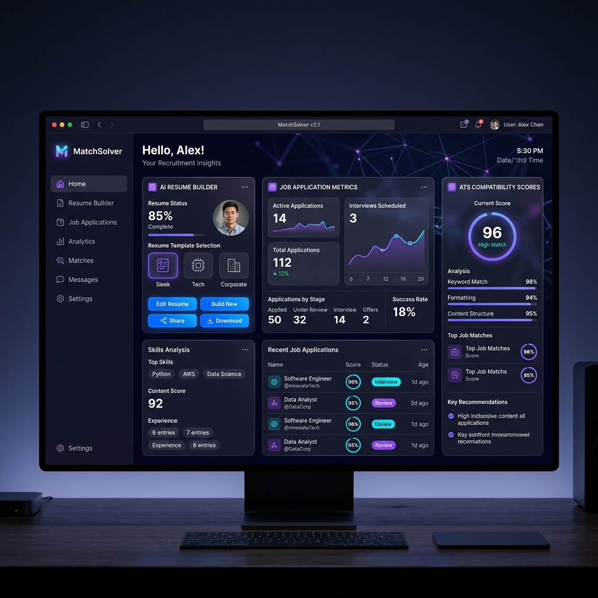

  
  <!-- Sleek Header Title -->
  <h1>👋 Hi, I'm Mohan Sai Kumar!</h1>
  <h3>🚀 Backend Developer & Systems Engineer</h3>
   

  <!-- Typing SVG -->
  

  <!-- Social Icons / Badges -->
  

    
    
    
  

---

### 💫 About Me
🚀 **Backend Developer** passionate about building clean, high-performance, and scalable systems.

- 💼 Currently engineering solutions at **Tata Nexarc**.
- 🚀 Co-developed **[MatchSolver.com](https://matchsolver.com)**, an AI-powered career growth platform.
- 🛠️ Specializing in **Java, Spring Boot, Microservices, and System Design**.
- 💳 Experienced in **Payment Gateways, Transactions, and OCR Invoice Systems**.
- 🎮 Casual gamer & massive fan of the **GTA** franchise.
- 🇮🇳 Based in **Andhra Pradesh, India**.

---

### 🚀 Featured Project: [MatchSolver.com](https://matchsolver.com)
**AI-Powered Career Optimization & Document Management Platform**

  <table border="0">
    <tr>
      <td width="60%" valign="top">
        <ul>
          <li>🤖 <b>AI Career Intelligence</b>: Integrates resume building, cover letter optimization, ATS screening, and mock interview preparation.</li>
          <li>⚙️ <b>50+ Automated Utilities</b>: Instant online processing suite for PDF, image, and text document formatting.</li>
          <li>⚡ <b>Production-Grade Architecture</b>: Engineered for high concurrency, low latency file parsing, and secure payment processing.</li>
        </ul>
      </td>
      <td width="40%" align="center">
        
      </td>
    </tr>
  </table>

#### MatchSolver Key Architecture & Features:
* **Resume Parsing Engine**: Utilizes custom optical character recognition (OCR) and text-processing pipelines to extract structured sections from uploaded PDFs and Word files.
* **AI Match Optimizer**: Evaluates job descriptions alongside user resumes to calculate ATS match rates, highlighting keyword gaps, formatting issues, and offering action-oriented optimizations.
* **Scale & Throughput**: Designed to process large file uploads asynchronously using thread pools, optimizing resource utilization and minimizing user response time.

---

### 💼 Professional Experience: Tata Nexarc
As a backend developer at **Tata Nexarc**, I focus on building reliable transactional features and processing document data:

1. **OCR Invoice Systems**:
   - Engineered pipelines to parse, extract, and structure invoice information using OCR utilities, reducing manual invoice indexing overhead.
   - Built sanitization and validation layers to ensure parsed transactional data maps cleanly to double-entry ledger structures.
2. **Transaction & Payment Gateways**:
   - Integrated reliable checkout pipelines with major payment gateways, handling webhook processing, automatic transaction retries, and reconciliation routines.
   - Implemented distributed locking (via Redis) to prevent double-spending and ensure transaction consistency under concurrent request spikes.

---

### 🛠️ Architecture & Workflows (Typical Microservices System)
Here is a high-level representation of the backend workflows and API architectures I design and build:

---

### ⚙️ Core Backend Engineering Principles
* **High Availability & Fault Tolerance**: Implementing Circuit Breakers (Resilience4j) and fallback mechanisms to keep downstream outages from propagating.
* **Database Optimization**: Designing normalized schemas, writing indexed queries, optimizing JPA/Hibernate mapping relationships to avoid the $N+1$ query problem, and configuring connection pools (HikariCP).
* **Caching & Session Routing**: Leveraging Redis for fast read-through and write-behind cache strategies, API rate-limiting, and managing shared user sessions across distributed instances.
* **Messaging & Event-Driven Architecture**: Decoupling long-running operations (like AI-processing and OCR conversions) from direct HTTP request threads using RabbitMQ queues to guarantee reliable job execution.

---

### 💻 Tech Stack

  <table>
    <tr>
      <td align="center"><b>Backend & Databases</b></td>
      <td align="center"><b>Frontend & UI</b></td>
      <td align="center"><b>DevOps & Tools</b></td>
    </tr>
    <tr>
      <td>
        
      </td>
      <td>
        
      </td>
      <td>
        
      </td>
    </tr>
  </table>

---

### 📐 Coding Standards & Design Patterns
* **SOLID Design**: Strictly adhering to SOLID principles and Clean Code rules to keep codebases understandable and modular.
* **API Standardization**: Structuring restful APIs with clean HTTP status mappings, custom exception handlers (`@ControllerAdvice`), and comprehensive Swagger/OpenAPI documentation.
* **Testing Guidelines**: Writing comprehensive unit and integration tests using JUnit, Mockito, and Testcontainers to validate behavior across database layers.

---

### 📊 GitHub Metrics & Insights

  <table border="0">
    <tr>
      <td align="center" width="50%">
        
      </td>
      <td align="center" width="50%">
        
      </td>
    </tr>
  </table>
  
   
  
  

---

### 🐍 My GitHub Contribution Snake

  

---

  
⭐ <b>If you like my work, consider giving a star to my repositories!</b>

