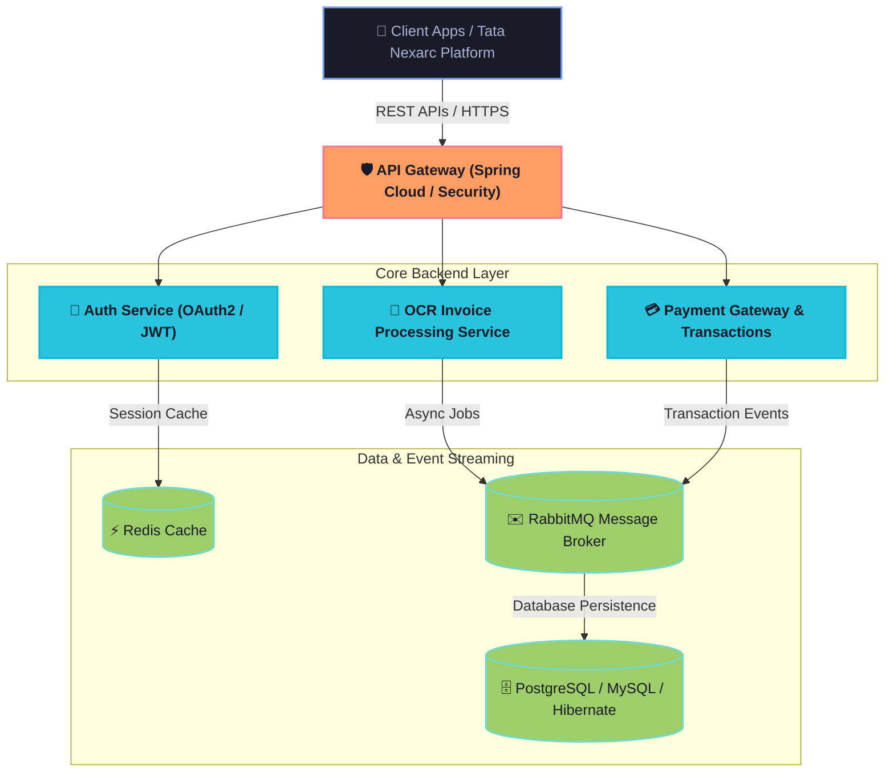

  
  <!-- Header Banner -->
  

  <!-- Typing SVG -->
  

  <!-- Social Icons / Badges -->
  

    
    
    
  

---

### 💫 About Me
🚀 **Backend Developer** passionate about building clean, high-performance, and scalable systems.

- 💼 Currently engineering solutions at **Tata Nexarc**.
- 🛠️ Specializing in **Java, Spring Boot, Microservices, and System Design**.
- 💳 Experienced in **Payment Gateways, Transactions, and OCR Invoice Systems**.
- 🎮 Casual gamer & massive fan of the **GTA** franchise.
- 🇮🇳 Based in **Andhra Pradesh, India**.

---

### 🛠️ Architecture & Workflows (Typical Microservices System)
Here is a high-level representation of the backend workflows and API architectures I design and build:

---

### 💻 Tech Stack

  <table>
    <tr>
      <td align="center"><b>Backend & Databases</b></td>
      <td align="center"><b>Frontend & UI</b></td>
      <td align="center"><b>DevOps & Tools</b></td>
    </tr>
    <tr>
      <td>
        
      </td>
      <td>
        
      </td>
      <td>
        
      </td>
    </tr>
  </table>

---

### 📊 GitHub Metrics & Insights

  <table border="0">
    <tr>
      <td align="center" width="50%">
        
      </td>
      <td align="center" width="50%">
        
      </td>
    </tr>
  </table>
  
   
  
  

---

  

---

  
⭐ <b>If you like my work, consider giving a star to my repositories!</b>

